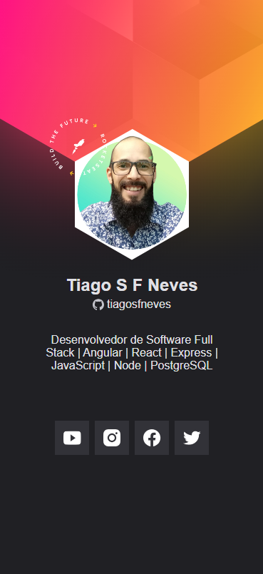

# Cracha virtual Estiloso

Este é um projeto de um crachá para eventos, permite a identificação dos usuários.

## Layout Final do Projeto:

## Vídeo de Apresentação e Link de Acesso ao Projeto

- Você pode acessar o projeto [aqui](https://bit.ly/Cracha_Virtual).

- Assista a um vídeo de apresentação do projeto no LinkedIn [aqui](https://bit.ly/Cracha_Virtual_In).

## Funcionalidades

- Busca dinâmica dos titulos da bio do perfil Github;
- Busca dinâmica da imagem do perfil Github;
- Links úteis para redes sociais;
- Evento de clique em JavaScript e HTML para abrir novas abas na janela;
- Design funcional e elegante.

## Tecnologias usadas

- HTML5
- CSS3
- JavaScript
- API JSON

## Instalação

Para começar a usar este projeto, siga os passos abaixo:

1. Clone o repositório para o seu computador local usando o seguinte comando no seu terminal:

- `git clone https://github.com/tiagosfneves/cracha_virtual_nlw.git`

2. Ou se preferir pode baixar o zip:
- Clique no botão `CODE` no cabeçalho desta página
- Deposi clique em `Download ZIP`

## Pré-requisitos

- Navegador da web com suporte a JavaScript.

## Uso

1. Abra o arquivo `index.html` no seu navegador.
2. Clique nos botões para testar e acessar as redes sociais.
3. Clique no botão "F12" para inspecionar o código-fonte.

Obs: Se os links estiverem desatualizados o crachá pode ter o layout modificado.

## Contribuição

Contribuições são bem-vindas! Sinta-se à vontade para abrir uma [issue](https://github.com/tiagosfneves/cracha_virtual_nlw/issues) ou enviar um [pull request](https://github.com/tiagosfneves/cracha_virtual_nlw/pulls) para melhorar este projeto.

## Contato Autor
Tiago Neves,  Desevolvedor Full Stack.
- [GitHub](https://bit.ly/Gh_tiagosfneves)
- [LinkedIn](https://bit.ly/In_tiagosfneves)

---
Este Projeto teve o incentivo da Desenvolvedora Back-End e P.O. [Flávia Martins](https://github.com/flaviamartins29).
